# Trees and Graphs

## Trees
We'll discuss trees first and then graphs, even though trees are really just a type of graph

### Types of Trees

A nice way to understand a tree is with a recursive explanation. A tree is a data structure composed of nodes.

- Each tree has a root node.
- The root node has zero or more child nodes.
- Each child node has zero or more childe nodes, and so on.

A tree cannot contain cycles. The nodes may or may not be in a particular order, they could have any data type as values, and they may or may not have links back to their parent nodes.

A very simple class definition for `Node` is:


```python
class Node:
    def __init__(self, name):
        self.name = name
        self.children = list()
```

You might also have a `Tree` class to wrap this node.


```python
class Tree:
    def __init__(self, root):
        self.root: Node = root
```

#### Trees vs. Binary Trees

A binary tree is a tree in which each node has up to two children. Not all trees are binary trees. For example, this tree is not a binary tree. You could call it a ternary tree.

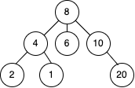

There are occasions when you might have a tree that is not a binary tree. For example, suppose you were using a tree to represent a bunch of phone numbers. In this case, you might use a 10-ary tree, with each node having up to 10 children (one for each digit).

A node is called a "leaf" node if it has no children.

#### Binary Tree vs Binary Search Tree

A binary search tree is a binary tree in which every node fits a specific ordering property: **all left descendents <= n < all right descendents**. This must be true for each node n.

Note that this inequality must be true for all of a node's descendents, not just its immediate children.

A binary search tree:

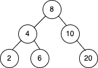

Not a binary search tree:

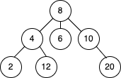

A binary search tree imposes the condition that, for each node, its left descendents are less than or equal to the current node, which is less than the right descendents.

#### Balanced vs. Unbalanced

While many trees are balanced, not all are. Note that balancing a tree does not mean the left and right subtrees are exactly the same size (like you see under "perfect binary trees" below).

One way to think about it is that a "balanced" tree really means something more like "not terribly imbalanced". It's balanced enought to ensure `O(log n)` times for `insert` and `find`, but it's not necessarily as balanced as it could be.

#### Complete Binary Trees

A complete binary tree is a binary tree in which every level of the tree is fully filled, except for perhaps the last level. To the extent that the last level is filled, it is filled left to right.

Not a complete binary tree:

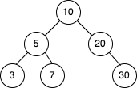

A complete binary tree:

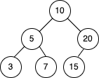

#### Full Binary Trees

A full binary tree is a binary tree in which every node has either zero or two children. That is, no nodes have only one child.

Not a full binary tree:

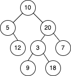

A full binary tree:

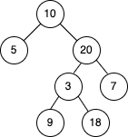

#### Perfect Binary Trees

A perfect binary tree is one that is both full and complete. All leaf nodes will be at the same level, and the level has the maximum number of nodes.

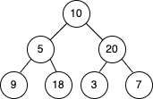

Note that perfect trees are rare, as a perfect tree must have exactly $2^k - 1$ nodes (where $k$ is the number of levels).


### Binary Tree Traversal

#### In-Order Traversal

In-order traversal means to "visit" (often, print) the left branch, then the current node, then the right branch.

```python
def in_order_traversal(node):
  if node is not None:
    in_order_traversal(node.left)
    visit(node)
    in_order_traversal(node.right)
```

When performed on a binary search tree, it visits the nodes in ascending order (hence the name "in-order").

#### Pre-Order Traversal

Pre-order traversal visits the current node before its child nodes (hence the name "pre-order").

```python
def in_order_traversal(node):
  if node is not None:
    visit(node)
    in_order_traversal(node.left)
    in_order_traversal(node.right)
```

In a pre-order traversal, the root is always the first node visited.

#### Post-Order Traversal

Post-order traversal visits the current node after its child nodes (hence the name "post-order").

```python
def in_order_traversal(node):
  if node is not None:
    in_order_traversal(node.left)
    in_order_traversal(node.right)
    visit(node)
```

In a post-order traversal, the root is always the last node visited.

### Binary Heaps (Min-Heaps and Max-Heaps)

We'll only discuss min-heaps here. Max-heaps are essentially equivalent, but the elements are in descending order rather than ascending order.

A min-heap is a _complete_ binary tree (that is, totally filled other than the rightmost elements on the last level) where each node is smaller than its children. The root, therefore, it the minimum element in the tree.

For example:

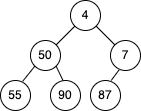

We have two key operations on a min-heap: `insert` and `extract_min`.

`Insert`

When we insert into a min-heap, we always start by inserting the element at the bottom. We insert at the rightmost spot so as to maintain the complete tree property.

Then, we "fix" the tree by swapping the new element with its parent, until we find an appropriate spot for the element. We essentially bubble up the minimum element.

- Step 1: Insert 2

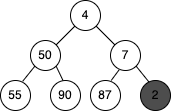

- Step 2: Swap 2 and 7

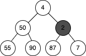

- Step 3: Swap 2 and 4

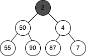

This take `O(log n)` time, where `n` is the number of nodes in the heap.

`Extract Minimum Element`

Finding the minimum element of a min-heap is easy: it's always at the top. The trickier part is how to remove it (in fact, this isn't that tricky).

First, we remove the minimum element and swap it with the last element in the heap (the bottommost rightnost element). Then, we bubble down this element, swapping it with one of its children until the min-heap property is restored.

Do we swap it with the left child or the right child? This depends on their values. There's no inherent ordering between the left and right element, but you'll need to take the smaller one in order to maintain the min-heap ordering.

- Step 1: Replace min with 80

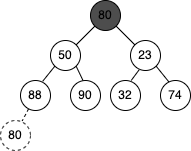

- Step 2: Swap 23 and 80

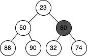

- Step 3: Swap 32 and 80

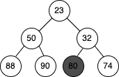

This algorithm will take `O(log n)` time.

### Tries (Prefix Trees)

A trie (sometimes called a prefix tree) is a funny data structure. A trie is a variant of an n-ary tree in which characters are stored at each node. Each path down the tree may represent a word.

The `*` nodes (sometimes called "null nodes") are often used to indicate complete words. For example, the fact that there is a `*` node under `MANY` indicates that `MANY` is a complete word. The existence of the `MA` path indicates there are words that start with `MA`.

The actual implementation of these `*` nodes might be a special type of child (such as a `TerminatingTrieNode`, which inherits from `TrieNode`). Or, we could use just a boolean flat `terminates` within the "parent" node.

A node in a trie could have anywhere from `0` to `ALPHABET_SIZE + 1` children.

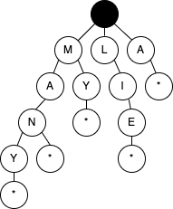

Very commonly, a trie us used to store the entire (English) language for quick prefix lookups. While a hash table can quickly look up where a string is a valid word, it cannot tell us if a string is a prefix of any valid words. A trie can do this very quickly.

How quickly? A trie can check is a string is a valid prefix in `O(K)` time, where `K` is the length of the string. This is actually the same runtime as a hash table will take. Although we often refer to has table lookups as being `O(1)` time, this isn't entirely true. A hash table must read through all the characters in the input, which take `O(K)` time in the case of a word lookup.

Many problems involving lists of valid words leverage a trie as an optimization. In situations when we search through the tree on related prefixes repeatedly (e.g., looking up `M`, then `MA`, then `MAN`, the `MANY`), we might pass around a reference to the current node in the tree. This will allow us to just check if `Y` is a child of `MAN`, rather than starting from the root each time.

## Graphs

A tree is actually a type of graph, but not all graphs are trees. Simply put, a tree is a connected graph without cycles.

A graph is simply a collection of nodes with edges between (some of) them

- Graphs can be either directed (like the following graph) or undirected. While directed edges are like a one-way street, undirected edges are like a two-way street.
- The graph might consist of multiple isolated subgraphs. If there is a path between every pair of vertices, it is called a "connected graph".
- Teh graph can also have cycles (or not). An "acyclic graph" is one without cycles.

Visually, you could draw a graph like this:

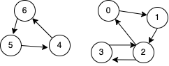

In terms of programming, there are two common ways to represent a graph.

### Adjacency List 

This is the most common way to represent a graph. Every vertex (or node) stores a list of adjacent vertices. In an undirected graph, an edge like `(a, b)` would be stored twice: once in `a`'s adjacent vertices and once in `b`'s adjacent vertices.

A simple class definition for a graph node could look essentially the same as a tree node.

```java
class Graph {
  public Node[] Nodes;
}

class Node {
  public String name;
  public Node[] children;
}
```

The `Graph` class is used because, unlike in a tree, you can't necessarily reach all the nodes from a single node.

You don't necessarily need any additional classes to represent a graph. An array (or a hash table) of lists (arrays, arraylists, linked lists, etc.) can store the adjacency list. The graph above could be represented as:

```python
0: 1
1: 2
2: 0, 3
3: 2
4: 6
5: 4
6: 5
```

This is a bit more compact, but it isn't quite as clean. We tend to use node classes unless there's a compelling reason not to.

### Adjacency Matrices

An adjacency matrix is an NxN boolean matrix (where N is the number of nodes), where a `true` value at `matrix[i][j]` indicates an edge from node `i` to node `j`. (You can also use an integer matrix with 0s and 1s).

In an undirected graph, an adjacency matrix will be symmetrics. In a directed graph, it will not (necessarily) be.

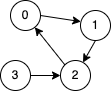

|       | **0** | **1** | **2** | **3** |
|-------|-------|-------|-------|-------|
| **0** | 0     | 1     | 0     | 0     |
| **1** | 0     | 0     | 1     | 0     |
| **2** | 1     | 0     | 0     | 0     |
| **3** | 0     | 0     | 1     | 0     |

The same graph algorithms that are used on adjacency lists (breadth-first search, etc.) can be performed with adjacency matrices, but they may be somewhat less efficient. In the same adjacency list representation, you can easily iterate through the neighbors of a node. In the adjacency matrix representation, you will need to iterate through all the nodes to identify a node's neighbors.

### Graph Search

The two most common ways to search a graph are depth-first search and breadth-first search.

In depth-first search (DFS), we start at the root (or another arbitrarily selected node) and explore each branch completly before moving on to the next branch. That is, we go deep first (hence the name _depth-first_ search) before we got wide.

In breadth-first search (BFS), we start a the root (or another arbitrarily selected node) and explore each neighbor before going on to any of their children. That is, we got wide (hence the name _breadth-first_ search) before we got deep.

See the below depiction of a graph and its depth-first and breadth-first search (assuming neighbors are iterated in numerical order).

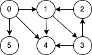

#### Depth-First Search
```python
1:  Node 0
2:    Node 1
3:      Node 3
4:        Node 2
5:        Node 4
6:  Node 5
```

#### Breadth-First Search
```python
1:  Node 0
2:  Node 1
3:  Node 4
4:  Node 5
5:  Node 3
6:  Node 2
```

Breadth-first search and depth-first search tend to be used in different scenarios. DFS is often preferred if we want to visit every node in the graph. Both will work just fine, but depth-first search is a bit simpler.

However, if we want to find the shortest path (or just any path) between two nodes, BFS is generally better. Consider representing all the friendships in the entire world in a graph and trying to find a path of frienships between `Ash` and `Vanessa`.

In depth-first search, we could take a path like `Ash -> Brian -> Carleton -> Davis -> Eric -> Farah -> Gayle -> Harry -> Isabella -> John -> Kari...` and then find ourselves very far away. We could go through most of the world without realizing that, in fact, `Vanessa` is `Ash`'s friend. We will still eventually find the path, but it may take a long time. It also won't find us the shortest path.


In breadth-first search, we would stay close to `Ash` for as long as possible. We might iterate through many of `Ash`'s friends, but we wouldn't go to his more distance connections until absolutly necessary. If `Vanessa` is `Ash`'s friend, or his friend-of-a-friend, we'll find this out relatively quickly.

##### Depth-First Search (DFS)

In DFS, we visit a node `a` and the iterate through each of `a`'s neighbors. When visiting a node `b` that is a neighbor of `a`, we visit all of `b`'s neighbors before going on to `a`'s other neighbors. That is, `a` exhaustively searches `b`'s branch before any of its other neighbors.

Note that pre-order and other forms of tree traversal are a form of DFS. The key difference is that when implementing this algorithm for a graph, we must check if the node has been visited. If we don't we risk getting stuck in an infinite loop.

The pseudocode below implements DFS:

```java
void search (Node root) {
  if (root == null) return;
  visit(root);
  root.visited = true;
  foreach (Node n in root.adjacent) {
    if (n.visited == false) {
      search(n)
    }
  }
}
```

##### Breadth-First Search (DFS)
BFS is a bit less intuitive. The main tripping point is the false assumption that BFS is recursive. It's not. Instead, it uses a queue.

In BFS, node `a` visits each of `a`'s neighbors before visiting any of _their_ neighbors. You can think of this as searching level by level out from `a`. An interative solution involving a queue usually works best.

```java
void search(Node root) {
  Queue queue = new Queue();
  root.marked = true;
  queue.enqueue(root); // Add to the end of queue

  while (!queue.isEmpty()) {
    Node r  = queue.dequeue(); // Remove from the front of the queue
    visit(r);
    foreach (Node n in r.adjacent) {
      n.marked = true;
      queue.enqueue(n);
    }
  }
}
```

Always remember for BFS that you use a queue.

##### Bidirectional Search

Bidirectional search is used to find the shortest path between a source and destination. It operates by essentially running two simultaneous breadth-first searches, one from each node. When their searches collide, we have found a path.


**Breadth-First Search**
Single search from `s` to `t` that collides after four levels.

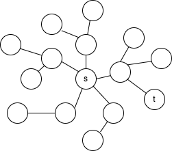

**Bidirectional Search**
Two searches (one from `s` and one from `t`) that collide after four levels total (two levels each).

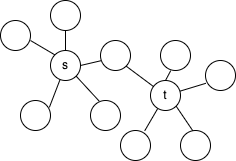

To see why this is faster, consider a graph where every node has at most $k$ adjacent nodes and the shortest path from node $s$ to node $t$ has length $d$.

- In traditional breadth-first search, we would search up to $k$ nodes in the first "level" of the search. In the second level, we would search up to $k$ nodes for each of those first $k$ nodes, so $k^2$ nodes total (thus far). We would do this $d$ times, so that's $O(k^d)$.
- In bidirectional search, we have two searches that collide after approximately $d/2$ levels (the midpoint of the path). The search from $s$ visits approximately $k^{d/2}$, as does the search from $t$. That's approximately $2*k^{d/2}$, or $O(k^{d/2})$, nodes total.

This might seem like a minor difference, but it's not. It's huge. Recall that $(k^{d/2})*(k^{d/2}) = k^d$. The bidirectional search is actually faster by a factor of $k^{d/2}$.

Put another way: if our system could only support searching "friend of friend" paths in breadth-first search, it could now likely support "friend of friend of friend of friend" paths. We can support paths that are twice as long.
